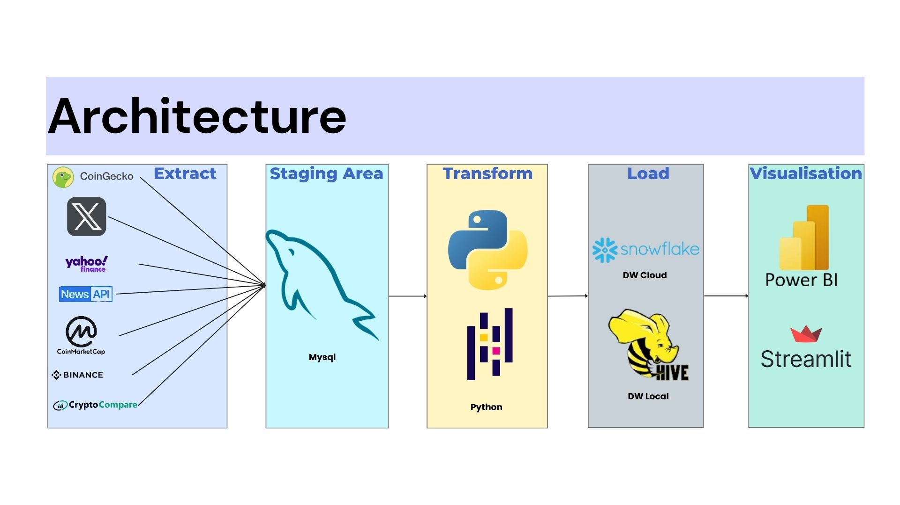

# Processes ETL for Cryptocurencies market Analysis

## Overview
This is a Business Intelligence (BI) project that involves creating a real-time ETL (Extract, Transform, Load) process. The project extracts Crypto Market Data from multiple sources, loads it into a staging area (MySQL), transforms it using Python, and then loads the transformed data into Data Warehouses (Snowflake and Hive). Finally, the project visualizes the collected data through interactive Dashboards built using Power BI and Streamlit.
---

## 📂 Repository Structure

```
├── hive.py                 # script to create the hiev datawarehouse schema
├── process_data.py         # script to create the snowflake datawarehouse schema
├── sql.py                  # script to create the mysql datawarehouse schema
├── Dashboard               # contains power bi dashboard and script file of streamlit dashboard
└── docker-hive-master      # contains files to conatenrize hive in docker 

```

### CODE/
```  
├── ETL/  
│   ├── 
│   ├── etl.py                  # script that use functions and connect to database used and manage the workflow
│   ├── load.py                 # functions to load to data warehouse
│   └── extract_transform.py    # conatins functions to extract from MYSQL and transform to data warehouse format
│  
└── streaming/  
    ├── coins_data              # contains python scripts to get blockchain data, dominanace, exchange rateand price of cryptocurencies
    ├── economic_data           # get data gold price, interest rate and stock price 
    ├── tweets_news             # contains script python to get news about crypto from websites NEWS api and X
    ├── data_ingestor.py        # script that use functions to extract from multiple APIs
```

---

## Used Technologies

The project leverages the following technologies:

- 
- 
- 
- 
- 
- 
- 


---

## Collaboration
This project was created in collaboration with **[Anouar Bouzhar](https://github.com/anouarbouzhar)**.

---
## 🚀 Using the Project
to use the project get the API from website as shown in the architecture images and create a .env file where you need to provide the connection informations and APIs
as follow : 

```  
user_snowflake=""
password_snowflake=""
snowflake_account=""

hive_host=''
hive_port=
hive_database=''
hive_username = ''

SQLhost='localhost'
SQLuser='root'
SQLpassword=''
SQLdatabase=''

blockchainAPI = '' # CoinmarketCap 
exchange_rateAPI = '' # coingecko
crypto_pricesAPI = '' # cryptocompare
newsAPI = '' # news
XTOKEN = '' # X

```
### Websites Links

Click on the logos to visit the websites:

<a href="https://newsapi.org/" target="_blank">
  
</a>

<a href="https://developer.x.com/en" target="_blank">
  
</a>

<a href="https://pro.coinmarketcap.com/api/v1/#" target="_blank">
  
</a>

<a href="https://www.binance.com/fr/binance-api" target="_blank">
  
</a>

<a href="https://www.coingecko.com/en/api" target="_blank">
  
</a>

<a href="https://min-api.cryptocompare.com/" target="_blank">
  
</a>

1. Clone the repository:
```bash
   git clone https://github.com/Elkholtihm/ETL-for-crypto-market-analysis.git
```

2. Install the required packages:
```bash
  pip install -r requirements.txt
```

3. Navigate to the CODE directory:
```bash
  cd CODE
```
4. create mysql database and data warehouse schema:
```bash
  python sql.py
  python hive.py
```
  OR
```bash
  python snowflake.py
```
5. To extract data from APIs:
```bash
  cd streaming && python etl.py
```
6. To extract from MYSQL, transform and load to Data warehouse
```bash
  cd ETL && python data_ingestor.py
```